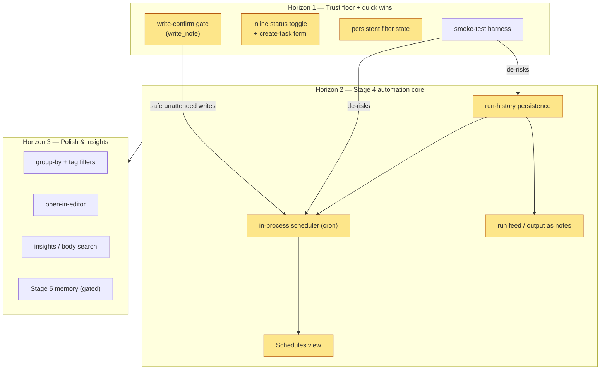

# Dashboard — Product Vision & Roadmap

> Strategy artifact for the `dashboard/` project. For the dense current-state snapshot see
> [[dashboard/_context_dashboard.md]]; for build/run + agent rules see [[dashboard/CLAUDE.md]]; the
> vault-root `CLAUDE.md` holds the full v1.x feature log. This doc is for *where we're going*, not *what exists*.

## North star

The dashboard is a **single-user, self-hosted cockpit** where the vault is the database and **agents do
real work** — summarize, scaffold, research — increasingly **unattended** — while staying a pleasant
daily-driver for viewing and managing notes. It should feel less like a read-only viewer and more like a
workspace that quietly keeps the vault in order.

**Standing constraints (unchanged):** build solo on Flask + vanilla JS · hybrid models (Ollama `fast` /
Claude `smart`) · vault-as-database (markdown + YAML frontmatter is the source of truth) · no Docker, no
auth, no multi-user · defer a vector DB until retrieval actually hurts.

## Where we are

**v1.5 / Stage 3 shipped** — task list, filters, folder browser, token-usage panel, dual-tier model
router, and a real tool-using agent loop with three agents. See [[dashboard/_context_dashboard.md]]
("Current state") for detail.

The roadmap below leans on primitives that **already exist** — it mostly schedules, gates, and surfaces
them rather than building new machinery:

- `run_agent()` + the `AGENTS` registry — `agent.py` (the model→tools→results loop)
- `chat()` / `chat_tools()` — `router.py` (every model call goes through here)
- `create_project_core()` and the in-memory `_RUNS` run store — `app.py`
- vault-confined, traversal-safe tools incl. `write_note` — `agent.py`

## Themes

Four lenses. The two **leads** drive near-term priority; the others are supporting or later.

- **① Agent automation (Stage 4) — LEAD.** Agents run on a schedule, unattended, and their results land
  as notes. This is the headline of the next chapter.
- **② Usability polish — LEAD.** The dashboard becomes a tool you *manage* the vault from — create, toggle,
  group, filter, bookmark — not just look at.
- **③ Reliability & trust — supporting.** The safety + test floor that makes unattended automation OK to
  turn on.
- **④ Insights & data — later.** Richer usage/vault-health analytics, body-text search, calendar/deadline views.

## Roadmap

Three horizons. Each item: *what · why · reuses*. Sizes: **S** (hours) / **M** (a day) / **L** (multi-day).

### Horizon 1 — Trust floor + quick wins

Do these first: they unblock *safe* automation and deliver immediate daily-driver value.

- **Write-confirm gate for `write_note`** · Theme ③ · **M.** Today `write_note` / `create_project` have
  free rein inside the vault. Add a dry-run/preview + approval path so interactive runs can confirm writes
  and unattended runs follow an explicit policy. *Why:* prerequisite for trusting cron agents. *Reuses:*
  the `write_note` tool and the per-step `emit` stream in `run_agent()`.
- **Inline status toggle + create-task form** · Theme ② · **M.** Mark a note complete / create a note with
  correct frontmatter from the UI, without leaving the dashboard. *Reuses:* the `create_project_core()`
  pattern in `app.py`, the `write_note` frontmatter shape, and the Projects-view form as the UI template
  in `templates/index.html`.
- **Persistent filter state** · Theme ② · **S.** Push filters + search into URL params so views are
  bookmarkable and survive reload. *Reuses:* the `?folder=` URL persistence already done for Browse.
- **Smoke-test harness** · Theme ③ · **M.** The first tests in the repo: route 200s (`/api/tasks`,
  `/browse`, `/usage`, `/agents`) + agent-tool path-traversal safety. *Why:* de-risks every later change.

### Horizon 2 — Stage 4 automation core (the headline)

- **Run-history persistence** · Theme ①/③ · **M.** Persist `_RUNS` (in-memory, FIFO-capped at 50 in
  `app.py`) to a JSON/SQLite file so scheduled runs survive restarts and leave an audit trail. *Why:*
  unattended output is worthless if it vanishes on restart.
- **In-process scheduler** · Theme ① · **L.** APScheduler (in-process — *ask before adding the dep* per
  [[dashboard/CLAUDE.md]]'s no-new-deps rule) registering agent runs on a cron, e.g. "every morning,
  summarize yesterday's daily-logs into a standup note." *Reuses:* `run_agent()` verbatim — the loop
  already exists; this only schedules and feeds it. Adds `/api/schedule` endpoints + a schedules store.
- **Schedules view** · Theme ①/② · **M.** A new sidebar view to create / list / enable / disable cron
  agent jobs and see last-run status. *Reuses:* the Agents-view streaming/polling UI pattern.
- **Run feed / output as notes** · Theme ① · **S–M.** Scheduled-run results land as notes (via the gated
  `write_note`) and show in a recent-runs feed. *Reuses:* persisted run history above.

### Horizon 3 — Polish & insights (later, opportunistic)

- **Group-by view + tag filters beyond area** · Theme ② · **S each.** JS-only; the backend already filters
  by type/status in `list_notes` (`agent.py`).
- **Open-note-in-default-editor** · Theme ② · **S.** A desktop-shell hook in `desktop.py`.
- **Richer insights** · Theme ④ · **M–L.** Vault-health metrics, deadline/calendar view, search across
  note *bodies* (not just title/topic).
- **Stage 5 — memory/embeddings** · Theme ④ · **L, gated.** Only if Stage 3/4 agents start fumbling
  context. Then add a vector store. Not before.

## Sequencing & dependencies

The trust floor comes *before* the automation it protects. Specifically: the **write-confirm gate** and
the **smoke-test harness** must land before unattended cron, and **run-history persistence** must precede
the **scheduler** and the **run feed** (a scheduled run with no durable output is pointless). Within
Horizon 1, the usability wins (status toggle, create-task, filter persistence) are independent and can ship
in any order alongside the gate.

*(Amber = the two lead themes — automation + usability. Arrows are real dependencies.)*

## Non-goals (for now)

Multi-user · authentication · Docker / containerization · vector DB / embeddings (Stage 5, gated) ·
mobile · cloud hosting. Keeping these out is what makes a solo Flask + vanilla-JS build tractable.

## Open questions

- Which local model to standardize on for the `fast` tier (default `llama3.2`)?
- How much `write_note` autonomy under automation — what's the default policy for unattended runs once the
  confirm gate exists?
- Where do scheduled-run outputs and notifications surface — a feed view, a note, a desktop notification,
  or all three?
